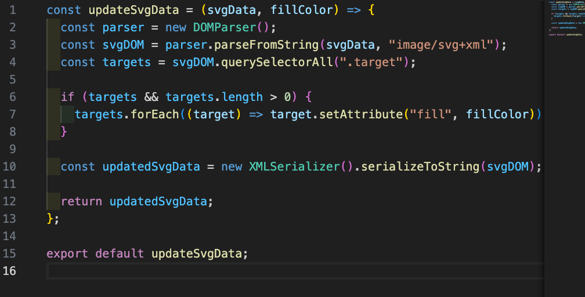
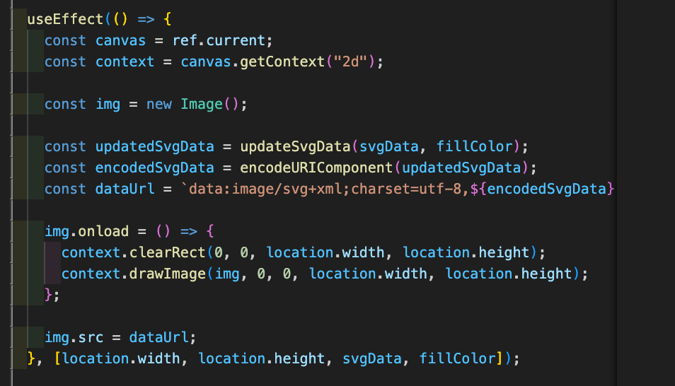
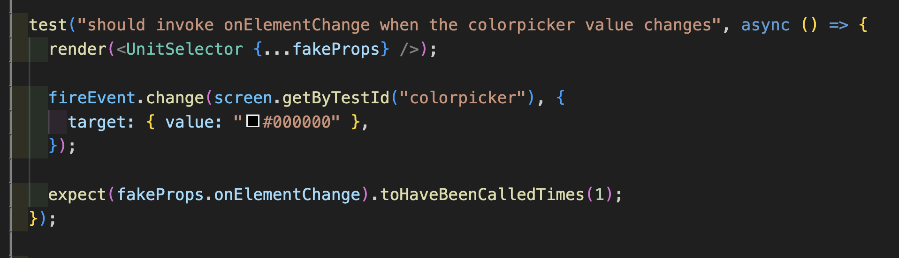
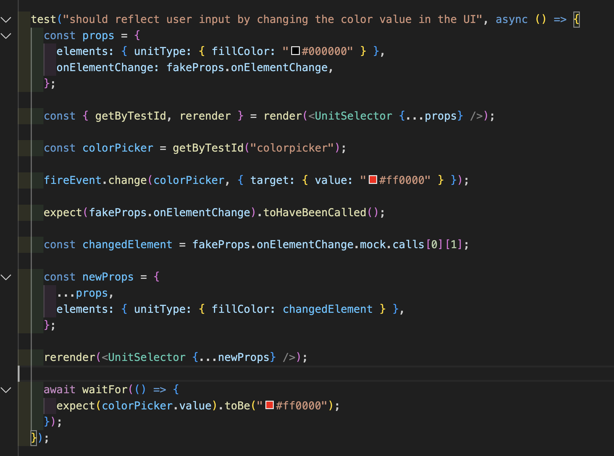
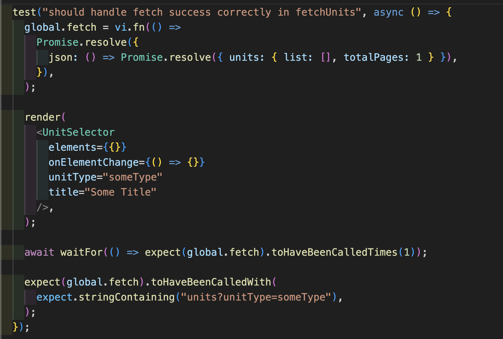
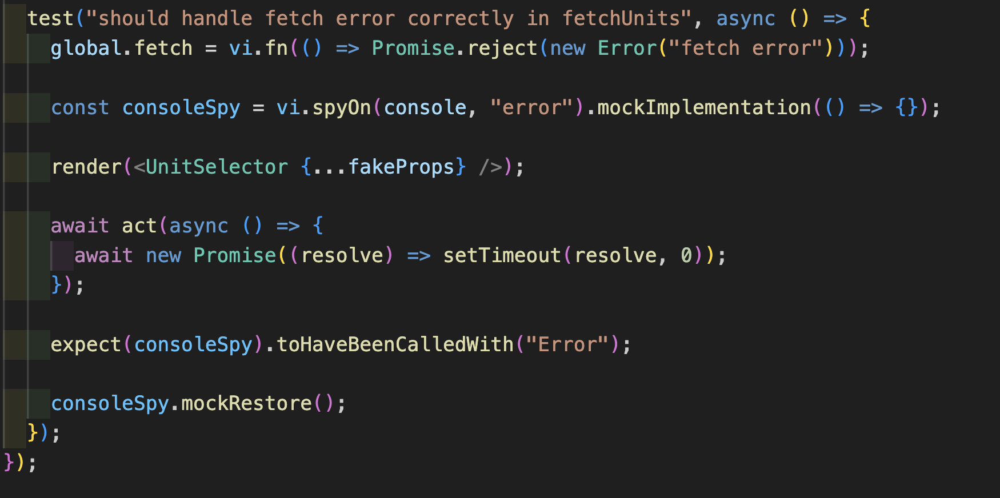
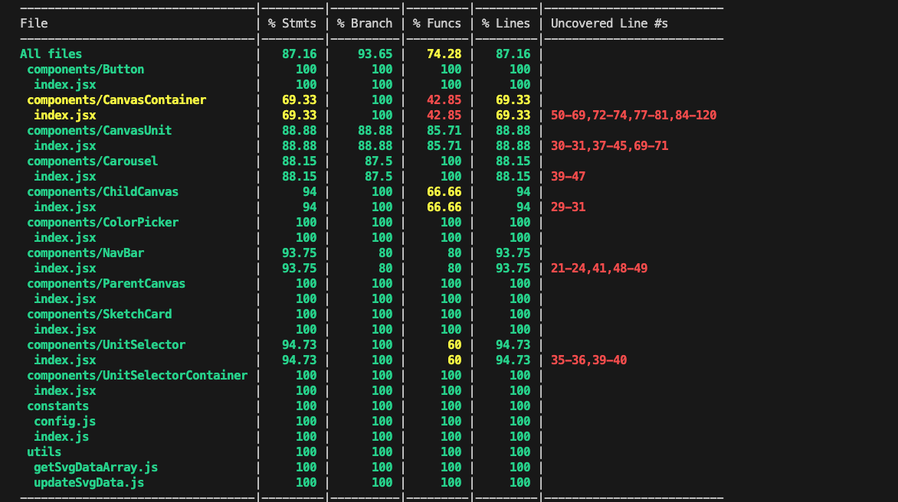

# Hello, Sketch!

사용자가 간단한 조작으로 자신만의 프로필 이미지를 만들 수 있는 웹 애플리케이션입니다.

<p align="center">
  
</p>

# 목차

- [동기](#동기)
- [주요 기능 소개](#주요-기능-소개)
- [프로젝트 관심사](#프로젝트-관심사)

  - [어떻게 하면 이미지를 그릴 수 있을까?](#어떻게-하면-이미지를-그릴-수-있을까)

    - [PNG vs SVG](#png-vs-svg)
    - [React에서 SVG 파일을 안전하고 효율적으로 렌더링하는 방법에 대한 고민](#react에서-svg-파일을-안전하고-효율적으로-렌더링하는-방법에-대한-고민)
    - [Canvas API 도입한 이유](#canvas-api-도입한-이유)
    - [사용자 입력에 따라 동적으로 svg 조작하기](#사용자-입력에-따라-동적으로-svg-조작하기)
    - [문자열화된 SVG 파일 렌더링하기](#문자열화된-svg-파일-렌더링하기)

  - [어떻게 해야 사용자가 만든 스케치를 이미지 파일로 저장할 수 있을까?](#어떻게-하면-이미지를-그릴-수-있을까)
    - [기존접근방식](#기존-접근-방식)
    - [문제점](#문제점)
    - [원인](#원인)
    - [해결방법](#해결-방법)
  - [어떻게 테스트할 것인가?](#어떻게-테스트할-것인가)

    - [어떻게 컴포넌트를 일관된 기준으로 테스트할 수 있을까?](#어떻게-컴포넌트를-일관된-기준으로-테스트할-수-있을까)
    - [어떤 것을 테스트할 수 있을까?](#어떤-것을-테스트할-수-있을까)
    - [커버리지](#커버리지)

  - [로그인 로직 보완하기](#로그인-로직-보완하기)
    - [기존 코드 문제점](#기존-코드-문제점)
    - [개선한 점](#개선한-점)

- [기술스택](#기술스택)
- [프로젝트 Ground Rule](#프로젝트-ground-rule)
- [팀원](#팀원)

---

# 동기

개발자가 되기로 마음먹은 순간부터 slack이나 gitHub의 프로필에 사용할 이미지가 필요했습니다. 자신의 개성이 담겨 있으면서도 사생활을 보호받을 수 있는 그런 이미지를 희망했습니다. 팀 프로젝트 주제를 고르던 중 때마침 인터넷에 무료로 제공하는 image library가 있는 것을 발견했습니다.

우리 팀 프로젝트인 Hello, Sketch!는 인터넷의 무료 이미지를 조합해서 사용자가 원하는 이미지를 생성해 주는 웹 애플리케이션을 만들어 보는 게 어떨까? 하는 생각에서 시작했습니다. 사용자가 간단한 조작으로 이미지를 만들어 저장하고, 이미지를 내려 받는 것을 우리 팀 프로젝트 목표로 삼았습니다.

우리 팀의 첫 프로젝트인 만큼 `Hello, World!`에서 Hello를 가져오고 사용자가 자신만의 이미지를 생성하는 행위를 Sketch에 비유하여서 팀 프로젝트 프로덕트 네임을 Hello, Sketch!라고 이름지었습니다.

# 주요 기능 소개

**프로필 이미지 선택 및 색상 변경**

<p align="center">
  
</p>

**프로필 이미지 이동 및 다운로드**

<p align="center">
  
</p>

# 프로젝트 관심사

## 어떻게 하면 이미지를 그릴 수 있을까?

### PNG vs SVG

PNG (Portable Network Graphics)는 래스터 파일 유형으로 분류되고 대표적으로 PNG, JPEG, GIF 등이 있습니다. 래스터 파일은 픽셀로 구성된 이미지를 뜻하며, 따라서 PNG는 작은 컬러 사각형인 픽셀이 무수히 많이 모인 이미지 파일입니다. 보통 래스터 이미지는 사이즈가 하나로 고정되어 있습니다. 따라서 그 크기가 바뀌면, 구성 요소인 픽셀이 변화되고 전체 이미지 역시 변형됩니다.

SVG (Scalable Vector Graphics)는 벡터 파일 유형에 해당하며 벡터 파일이란 컴퓨터가 도형, 테두리, 점, 선 등을 이용하여 이미지를 만들어 내는 것을 뜻합니다. 픽셀을 사용하지 않아서 크기에 상관없이 이미지가 언제나 동일한 모습을 유지할 수 있습니다. XML로 작성되서 텍스트 편집기로 편집할 수 있고 프로그래밍 언어를 이용하여 SVG 속성을 변경할 수 있습니다.

프로젝트에서 사용자의 액션에 의해 이미지의 색상, 위치, 사이즈 등을 변경하는 것이 핵심 기능이었습니다. 따라서 프로그래밍 언어로 파일의 속성을 변경할 수 있는 SVG를 이미지 파일 포맷으로 결정하게 되었습니다.

### React에서 SVG 파일을 안전하고 효율적으로 렌더링하는 방법에 대한 고민

SVG를 직접 렌더링 하는 대신 Image 객체를 이용하여 canvas에 그리는 방식을 프로젝트에 적용했습니다. 이와 같은 방식은 보안 문제, 동적 조작이 용이성, 크로스 플랫폼 호환성 등의 이유에서 SVG를 직접 렌더링하는 방식보다 좋은 점이 있습니다. SVG 파일을 직접 렌더링할 경우, 내장된 JavaScript 객체가 실행되어 XSS(크로스 사이트 스크립팅) 공격에 취약할 수 있습니다. 반면에 Image 객체를 통해 SVG data를 로드하면 내장된 스크립트가 실행되지 않기 때문에 보안 문제에 대응할 수 있습니다. 또한 canvas에서 Image 객체를 그려내는 방식은 Canvas API의 내장 메서드를 이용하여 이미지의 크기, 위치를 변경하는게 훨씬 수월합니다. SVG는 모든 웹 브라우저 동일하게 렌더링하지 않을 수 있습니다. SVG data를 canvas를 통해 렌더링하면 브라우저가 자체적으로 이미지를 처리하고 canvas에는 최종 결과물만 렌더링되기 때문에 브라우저 간의 일관성 문제를 줄일 수 있습니다.

### Canvas API 도입한 이유

SVG 이미지 요소를 직접 조회 및 조작하기가 어렵기 때문에, `div` 태그로 wrapping 하는 방식을 고려했습니다. div를 사용한 방식은 SVG가 DOM의 일부로 취급되어 JavaScript를 이용해 SVG 이미지 크기 및 위치 조절과 같은 조작이 쉬워집니다. 뿐만 아니라 CSS를 통한 스타일링도 용이합니다. 하지만 `div` 태그로 wrapping 하는 방식으로는 라이브러리 없이 이미지 다운로드를 구현하기가 어렵다는 것을 알게 되었습니다. 따라서 프로젝트 막바지 무렵에 canvas 태그로 SVG를 wrapping하는 방식을 검토하게 되었습니다.

Canvas API는 HTML5의 일부로, 웹 브라우저에서 2D 그래픽을 그리는 데 사용됩니다. 이 API는 **`<canvas>`** 요소를 통해 제공되며, **`<canvas>`** 요소는 웹 페이지에 그래픽을 그릴 수 있는 영역을 제공합니다. canvas를 사용하는 방식은 DOM의 일부로 간주되지 않아서 익숙한 DOM API를 사용할 수 없고 또한 canvas 내부의 그래픽에 대한 스타일링 또한 CSS를 이용하지 못하고 JavaScript를 통해 프로그래밍적으로 이루어져야 합니다.

요소 선택 및 조작 그리고 스타일링에 기존에 사용했던 방식을 이용하지 못하고 새롭게 Canvas API를 공부를 했어야 했습니다. 그럼에도 이미지 다운로드 기능이 가능했기 때문에, SVG를 canvas에 그리는 방식을 채택하게 되었습니다.

### 사용자 입력에 따라 동적으로 SVG 조작하기

<p align="center">
  
</p>

**`updateSvgData`** 함수는 문자열화 된 SVG 데이터와 색상을 인자로 받아, SVG 내의 특정 요소들의 색상을 변경하는 기능을 수행합니다. 함수는 먼저 **`DOMParser`** 객체를 생성하여 SVG 데이터 문자열을 DOM 형태로 파싱합니다. 이 파싱 과정으로 문자열 형태의 SVG 데이터를 DOM(Document Object Model)으로 변환하여, JavaScript가 이를 조작할 수 있게 합니다.

함수는 DOM 내에서 클래스 이름이 **`.target`** 인 모든 요소를 찾고,각 요소에 대해, **`forEach`** 반복문을 사용하여 해당 요소의 **`fill`** 속성을 입력받은 색상(**`fillColor`**)으로 설정합니다. 이러한 과정을 통해 해당 클래스를 가진 모든 SVG 요소들의 색상이 변경됩니다.

마지막으로, **`XMLSerializer`** 객체를 사용하여 수정된 DOM을 다시 SVG 데이터 문자열로 직렬화하고, 이 문자열을 반환합니다.

### Image 객체를 이용해 Canvas에 렌더링하기

<p align="center">
  
</p>

이미지를 렌더링할 때 Canvas API를 이용하였습니다. **`updateSvgData`** 함수를 호출하여 반환된 SVG 데이터는(문자열) **`encodeURIComponent`**를 통해 URI 안전 문자열로 인코딩되고, 이를 Data URL 형식으로 변환합니다. 이 Data URL을 Image 객체의 소스(**`src`**)로 설정합니다. Image 객체가 canvas를 통해 렌더링하게 하여 브라우저가 자체적으로 이미지 처리하여 내장된 스크립트가 실행되는 것을 방지해 XSS와 같은 보안 문제에 대응하고자 했습니다.

## 어떻게 해야 사용자가 만든 스케치를 이미지 파일로 저장할 수 있을까?

### 기존 접근 방식

처음에는 세 개의 하위 canvas(`ChildCanvas`)를 포함하는 상위 canvas(`ParentCanvas`) 컴포넌트에 아래와 같은 작업을 해보았습니다.

- `ParentCanvas` 내부에 “다운로드” 버튼을 추가한다.
- “다운로드” 버튼이 눌리면, `ParentCanvas` 의 canvas 요소들을 PNG 이미지로 변환해서 내려받도록 해준다.

### 문제점

"다운로드" 버튼을 눌렀을 때, 상위 ParentCanvas가 하위 ChildCanvas의 요소들을 포함하지 않은 채로 흰 화면만 다운로드되는 현상이 발생했습니다.

### 원인

각각의 canvas는 독립적인 렌더링 영역을 가집니다. 따라서 ParentCanvas와 ChildCanvas가 각각 독립적인 렌더링을 가지고 있었기 때문에, ParentCanvas만을 대상으로 이미지를 생성하면 ChildCanvas의 내용이 포함되지 않았습니다. `ParentCanvas` 가 `ChildCanvas` 의 요소들을 담기 위해서 가지고 있던 틀에 해당되는 흰색 사각형만 그려진 채로 이미지가 만들어진 것입니다.

### 해결 방법

각 ChildCanvas 요소들을 하나의 새로운 canvas에 그리게 했습니다. 이렇게 하면 각각의 canvas가 별도로 존재하는 대신, 모든 요소들이 하나의 canvas에 통합되어 이미지로 만들어집니다. “다운로드” 버튼이 눌리면, 새로운 canvas를 만들고, 그 위에 `ChildCanvas` 의 요소들을 그린 뒤에 다운로드 하는 방식으로 수정하였습니다.

```jsx
// 세 개의 canvas 요소들을 새로운 canvas 위에 그리고, 이미지 데이터로 변환하는 함수
const mergeCanvas = () => {
  const headCanvas = canvasRefs.headCanvas.current;
  const faceCanvas = canvasRefs.faceCanvas.current;
  const bodyCanvas = canvasRefs.bodyCanvas.current;
  const mergedCanvas = document.createElement("canvas");
  mergedCanvas.width = 700;
  mergedCanvas.height = 700;
  const mergedContext = mergedCanvas.getContext("2d");
  mergedContext.fillStyle = "white";
  mergedContext.fillRect(0, 0, mergedCanvas.width, mergedCanvas.height);
  mergedContext.drawImage(bodyCanvas, bodyUnit.x, bodyUnit.y);
  mergedContext.drawImage(headCanvas, headUnit.x, headUnit.y);
  mergedContext.drawImage(faceCanvas, faceUnit.x, faceUnit.y);
  const mergedDataURL = mergedCanvas.toDataURL("image/png");
  return mergedDataURL;
};
// 이미지 다운로드 관련 함수들
const handleImageDownload = () => {
  const mergedDataURL = mergeCanvas();
  downloadImage(mergedDataURL);
};
const downloadImage = (dataURL) => {
  const link = document.createElement("a");
  link.download = "merged_image.png";
  link.href = dataURL;
  link.click();
};
```

## 어떻게 테스트할 것인가?

이번 팀 프로젝트에서 unit test 위주로 테스트하기로 논의를 하였습니다. unit test에서 테스트 해야할 것은 각각의 컴포넌트들의 기능 및 렌더링이 예상대로 이루어지고 있는지 확인하는 것입니다. 테스트코드를 작성하며 느꼈던 점은 다음 프로젝트에서도 사용할 수 있도록 어떤 기준으로 테스트할지에 대한 일관된 기준이 필요하다는 것이었습니다. 따라서 체크리스트를 만들었고 테스트코드를 작성할 때 이를 적용해보았습니다.

### 어떻게 컴포넌트를 일관된 기준으로 테스트할 수 있을까?

다음은 테스트코드 체크리스트 세부사항입니다.

| 테스트 카테고리       | 세부 사항                                                                                                                                                   |
| --------------------- | ----------------------------------------------------------------------------------------------------------------------------------------------------------- |
| 1. Test Rendering     | 1.1. 컴포넌트가 기본 Props와 함께 정상적으로 렌더링되는지 확인<br>1.2. 실제 DOM 요소와 속성 테스트<br>1.3. 렌더링 시 error 없음<br>1.4. 모든 변수 선언 확인 |
| 2. Test the Output    | 2.1. JSX 엘리먼트들이 적절한 Props 값을 가지고 정확하게 렌더링되는지 확인                                                                                   |
| 3. Test the Events    | 3.1. 이벤트(버튼 클릭, 입력 변경 등)가 예상대로 함수를 호출하는지 확인                                                                                      |
| 4. Test Data Fetching | 4.1. Fetch 성공: 로딩 상태 및 데이터 로드 후 UI 업데이트 확인<br>4.2. Fetch 실패: 에러 시 UI 에러 상태 표시 확인                                            |

### 어떤 것을 테스트할 수 있을까?

**사용자 이벤트를 통해서 UI 변화를 테스트**

`fireEvent.change` 는 사용자의 액션 (input filed의 색 변경)을 시뮬레이트합니다. 이 액션 자체가 React 컴포넌트의 상태나 props를 직접 변경하지 않습니다. 따라서 사용자 액션을 시뮬레이트하고 UI 업데이트 방식을 테스트하기 위해서는 추가적인 작업이 필요합니다. 그 방식은 아래처럼 두 가지 방식을 고민해볼 수 있었습니다.

<aside>

1. 사용자 액션 발생 시 해당 컴포넌트의 **이벤트 핸들러가 단순히 호출되는지 테스트**하는 방식

2. 해당 컴포넌트의 **이벤트 핸들러 호출하여 `rerender` 로 props를 변경을 확인**하는 방식

</aside>

**첫 번째 방식: 이벤트 핸들러 호출**

<p align="center">
  
</p>

이벤트 핸들러 호출 방식은 비교적 간단합니다. 사용자 액션에 의해서 해당 요소의 이벤트 핸들러 함수가 호출되는지를 테스트하면 되고, 위의 예시에서는 사용자 액션에 의해 이벤트 핸들러 함수가 1회 호출되는지를 테스트하였습니다.

**두 번째 방식**
두 번째 방식은 이벤트 핸들러 호출의 결과로 컴포넌트의 props가 올바르게 업데이트가 되었는지를 테스트합니다. `rerender` 를 사용하여 컴포넌트가 새로운 props를 받아서 리렌더링되고 이를 통해 컴포넌트가 사용자 액션을 올바르게 처리하는지 테스트할 수 있습니다.

 <p align="center">
  
</p>

**mocking fetch를 왜 하는걸까?**

Mocking은 컴포넌트가 참조하고 있는 외부코드를 가짜로 대체하는 방법입니다. 그렇다면 왜 또 fetch를 Mocking하는걸까요? 그 이유는 테스트에서 실제 네트워크 요청과 같은 트랜잭션이 발생하지 않게 하기 위해서 입니다. 테스트할 코드에 DB에 저장하는 로직이 있다면, 실제로 DB로 트랜젝션이 일어나지 않는다면 코드에서 에러가 발생하게 됩니다. 그렇게 된다면, 개발자가 테스트하고 싶은 로직을 테스트 하지 못한 채 테스트의 run error가 발생하게 됩니다. 따라서 실제로 DB 트랜잭션이 일어나지 않았지만 트랜잭션이 일어난 것으로 간주하여 해당되는 코드에서 에러가 발생하지 않게 해야 합니다. fetch를 mocking하는 것은 테스트 환경에서 실제 구현을 대체하기 위해 사용합니다. mock 함수를 호출했을 때 반환 받기 원하는 값을 개발자가 지정하고, 이 리턴값을 사용해서 로직을 테스트합니다.

<p align="center">
  
</p>

**`global.fetch`**는 JavaScript에서 비동기 네트워크 요청을 수행하는 데 사용되는 함수입니다. 여기서는 vi를 사용하여 모킹(mocking)하였고 이렇게 하면 실제 API 엔드포인트에 요청을 보낼 필요 없이 **`fetch`** 호출을 시뮬레이션할 수 있습니다. 실제 테스트에서는 **`global.fetch`**가 올바른 인수로 한 번 호출되는지 확인합니다. 또한 **`fetch`**가 호출될 때 전달된 URL이 **`"units?unitType=someType"`** 문자열을 포함하고 있는지 확인합니다.

<p align="center">
  
</p>

**에러 테스트하기**

`fetch`** 요청 시 에러를 올바르게 핸들링하는지 확인하는 것입니다. 여기서는 **`console.error`\*\*가 예상대로 호출되는지 검사하고 있습니다.

### 커버리지

<p align="center">
  
</p>

## 로그인 로직 보완하기

### 기존 코드 문제점

기존 코드에서 클라이언트는 Firebase을 통해 얻은 사용자 정보를 sessionStorage에 저장하고, 이후 HTTP 요청 시 사용자 정보를 서버에 보냅니다. 서버에서는 Firebase-admin을 이용하여 firebase token을 검증하고 유효한 사용자의 요청을 허용하는 구조로 로그인 로직을 작성였습니다. 이 구조에서는 XSS(Cross Site Scripting) 공격 즉, 악의적인 스크립트가 주입되면 사용자 데이터가 공격자에 의해 쉽게 탈취될 수 있는 문제가 발생할 수 있습니다. 따라서 클라이언트와 서버 간 사용자 정보를 세션 스토리지에 저장하고 통신하는 방식을 보완할 방법을 찾게 되었습니다.

### 개선한 점

기존 세션 스토리지 저장된 토큰 기반 통신 방식에서 쿠키 기반 통신 방식으로 변경하고자 하였습니다. 변경한 이유는 쿠키 기반 통신 방식이 쿠키에 HTTP Only 속성을 적용하여 XSS부터 토큰을 보호할 수 있기 때문이었습니다. 기존의 방식이 Firebase 토큰과 sessionStorage를 사용하는 구조였다면, 새로운 방식은 쿠키 기반의 통신 방식으로 전환하면서 기존 코드의 보안적 취약점을 개선해보려 했습니다. 전체적인 로그인 flow는 클라이언트가 사용자 정보를 서버에 전달하고 서버에서는 해당 정보로 jwt 토큰을 만들고 클라이언트에게 쿠키로 전달합니다. 이후, 클라이언트의 HTTP 요청에는 쿠키에 토큰이 담겨져 서버로 보내지고, 서버에서는 해당 쿠키로 검증하여 유효한 사용자인지 판단하게 됩니다.

기존의 토큰 기반 시스템에서는 클라이언트가 서버에 요청을 보낼 때마다 HTTP 요청의 헤더에 토큰을 수동으로 포함시켜야 했습니다. 이 토큰은 사용자 인증 정보를 담고 있기 때문에, 만약 CSRF (Cross-Site Request Forgery) 공격이 발생하면, 공격자는 이 토큰을 이용해 사용자가 인증된 것처럼 서버에 요청을 보낼 수 있습니다. 그러면 해당 요청은 사용자의 토큰이 포함되어 서버에서 유효한 요청으로 인식될 수 있습니다.

쿠키를 사용하는 경우, 브라우저는 자동으로 모든 HTTP 요청에 쿠키를 첨부합니다. 이 때문에 클라이언트는 매 요청 시 토큰을 수동으로 첨부할 필요가 없어집니다. 하지만 쿠키 자체가 CSRF 공격을 완전히 방지하지는 못합니다. 이를 해결하기 위해 'SameSite' 쿠키 속성과 같은 추가적인 보안 조치가 필요합니다. `'SameSite=Lax'` 설정을 사용하여 쿠키가 다른 도메인 간 요청에서 전송되는 것을 제한하여 CSRF 공격 즉, 사용자가 의도하지 않은 다른 사이트의 요청에서 쿠키가 전송되는 것을 방지하였습니다.

개선한 로그인 시나리오는 다음과 같습니다.
| 단계 | 기존 방식 | 개선된 방식 |
|------|-----------|-------------|
| 1. 로그인 | Firebase를 통해 얻은 사용자 정보를 sessionStorage에 저장 | 동일 |
| 2. 사용자 정보 요청 | 사용자 정보를 서버에 요청 | 동일 |
| 3. 서버에서의 사용자 체크 | 사용자 조회 및 저장 | 동일 |
| 4. 토큰 생성 및 전달 | - | 서버에서 JWT 토큰 생성, DB에 저장, 클라이언트에 쿠키로 전달 |
| 5. HTTP 요청 | HTTP 요청 시 token을 수동 전달 | 클라이언트가 모든 HTTP 요청에 쿠키를 브라우저가 자동 전달 |
| 6. 사용자 검증 | 서버에서 verifyToken 미들웨어로 firebase token 검증 | 서버에서 verifyCookie 미들웨어를 통해 사용자 검증 |

# 기술스택

- Frontend

  - JavaScript, React, Tailwind CSS

- Backend

  - JavaScript, Node.js, Express.js

- Test

  - React Dom Testing Library, vitest

- Deployment
  - Netlify, AWS Elastic Beanstalk

# 프로젝트 Ground Rule

- [협업규칙](https://mirage-ceres-274.notion.site/bb8110834c074152be6d89b216fcd120)

# 팀원

<table>
  <tr>
    <td align="center">
      <a href="https://github.com/donghyukkil">
        
      </a>
    </td>
     <td align="center">
      <a href="https://github.com/jongwoobaek">
        
    </td>
    <td align="center">
      <a href="https://github.com/mangodm-web">
        
    </td>
  </tr>
  <tr>
    <td>
    <ul>
      <li><a href="https://github.com/donghyukkil">길동혁</a></li>
    <li>asterism90@gmail.com</li>
  </ul>
    </td>
    <td>
    <ul>
      <li><a href="https://github.com/jongwoobaek">백종우</a></li>
    <li>qorwhddn1234@gmail.com</li>
  </ul>
    </td>
       <td>
    <ul>
      <li><a href="https://github.com/mangodm-web">허다미</a></li>
    <li>dmhuh.data@gmail.com</li>
  </ul>
    </td>
  </tr>
</table>
